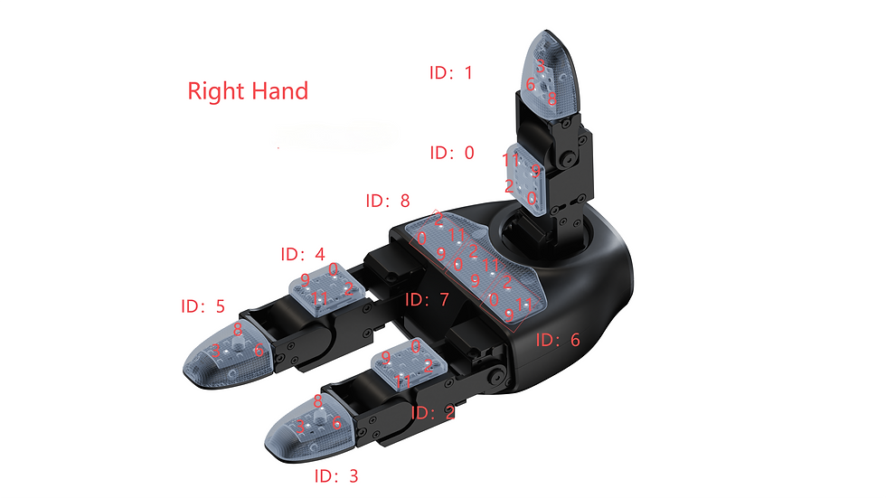

# Mapping And Markers

The mapping file is:

```text
config/dex3_right_pressure_seed.yaml
```

It is a flat list of taxels. Each entry says which raw pressure slot drives one
RViz marker and where that marker is drawn relative to a URDF link.

```yaml
taxels:
  - name: upper_finger_pad
    group: 4
    cell: 9
    frame_id: right_hand_index_0_link
    xyz: [0.038500, 0.016000, 0.005000]
    rpy: [0.0, 0.0, 0.0]
    scale: [0.009000, 0.002000, 0.008000]
    label_offset: [0.000000, 0.008000, 0.000000]
```

## Fields

- `group`: `press_sensor_state[group]`.
- `cell`: `pressure[cell]`.
- `frame_id`: URDF/TF frame to attach the marker to.
- `xyz`: marker center in the frame.
- `rpy`: marker orientation in the frame.
- `scale`: marker dimensions.
- `label_offset`: offset for the text label.

There is no grid-orientation inference in the visualizer. If a marker is in the
wrong place, edit that marker's explicit `xyz`, `rpy`, or `scale`.

## Source And Trust Level

The initial ID/cell placement was seeded from the Meko G1/Dex3-1 article:

https://www.mekosrl.it/post/n-2-2-unitree-g1-umanoide-robot-tutto-ci%C3%B2-che-c-%C3%A8-da-sapere-sviluppo-applicazioni-sdk-descriz

The article states that the figure ID corresponds to `PressSensorState_` and
that the `pressure[12]` indices are marked in the figure.

The final authority is live probing on the physical hand. If repeated touches
contradict the seed image, trust the physical hand.

## Reference Image



## Editing Procedure

1. Launch RViz with labels enabled.
2. Touch one physical taxel repeatedly.
3. Watch which `group:cell` changes in the logs or heatmap.
4. Edit only the matching YAML entry.
5. Relaunch the visualizer.

With a symlink install, YAML edits do not require rebuilding.

## Common Link Names

The seed file assumes these right-hand frames exist:

```text
right_hand_palm_link
right_hand_thumb_1_link
right_hand_thumb_2_link
right_hand_index_0_link
right_hand_index_1_link
right_hand_middle_0_link
right_hand_middle_1_link
```

If your URDF uses different names, update `frame_id` in the YAML.
